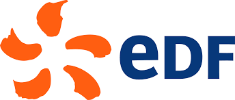

  

## À propos de moi

Passionné par l'**Intelligence Artificielle** et la **Data Science**, je suis actuellement étudiant en école d'ingénieur à l'**UTBM** (Université de Technologie de Belfort-Montbéliard) et à l'**UQAC** (Université du Québec à Chicoutimi). 

Mon objectif est de contribuer à des projets innovants en IA et d'approfondir mes compétences dans ce domaine.

📍 **Localisation**: France / Canada  
🎓 **Formation**: Programme de double diplôme : 
                Ingénieur en Génie informatique, spécialité IA et Data Science, UTBM
                Maitrise en Intelligence Artificielle, UQAC
**Intérêts**: Machine Learning, Deep Learning, Data Analysis, Computer Vision, Mathématiques, Nouvelles Technologies

---

## 🛠️ Compétences Techniques

### Langages de Programmation

### Machine Learning & Deep Learning

### Data Science & Analysis

### Outils & Technologies

## Projets

| Projet | Description | Technologies |
|--------|-------------|--------------|
| 🎤 **LipRead** | État de l'art complet, adaptation et fine tuning de modèles de lecture labiale | Deep Learning, Computer Vision |
| 🏆 **RAG Chatbot** | 2ème place (1000$) au Hackathon IA de l'UQAC : Agent conversationnel RAG pour faciliter la compréhension d'incidents de sécurité en entreprise | RAG, NLP, LLM |
| 🔬 **ConvNext** | Présentation approfondie et implémentation d'un papier de recherche sur les CNNs et les Transformers | CNN, Transformers, PyTorch |
| 🐔 **CNN médical** | Partenariat avec le CERSA Togo, reconnaissance de maladies sur des volailles avec les CNNs | CNN, Computer Vision, TensorFlow |

---

## Expérience Professionnelle

<table>
  <tr>
    <td width="80" align="center">
      
    </td>
    <td>
      <strong>Data Analyst</strong> — Électricité de France, Direction Commerce 
      <em>2024/25 (6 mois)</em> | Colombes (92)  
      • Analyse et extraction de données pour des acteurs du numérique (IA, recherche, applications) ou commerciaux (finance, marketing, relation clients) 
      • Développement de solutions Data pour un usage interne, automatisation d'extractions 
      • Volumétrie et enjeux importants : <strong>+22 millions de clients</strong>, <strong>+25 millions de contrats</strong>
    </td>
  </tr>
</table>

---

## Contact

---

